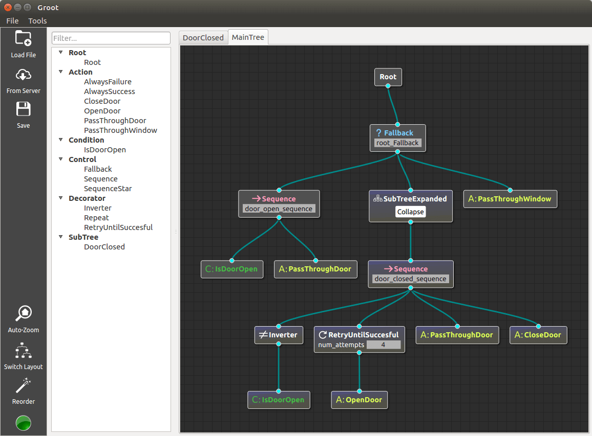

# Groot

**Groot** is a Graphical Editor, written in C++ and Qt, to create [BehaviorTrees](https://en.wikipedia.org/wiki/Behavior_tree).

It is compliant with the the library [BehaviorTree.CPP](https://github.com/BehaviorTree/BehaviorTree.CPP).

# Quick Start

You can download and launch Groot straight away downloading the latest 
[AppImage](https://github.com/BehaviorTree/Groot/releases/download/0.4.0/Groot-0.4-x86_64.AppImage) .

It should work wit Ubuntu 16.04 or later.

# Dependencies, Installation, and Usage

To compile the project you need:

- [CMake 3.2](https://cmake.org/download)
- Qt5 (tested with version 5.5.1), including the SVG module.

On Ubuntu Xenial or later, you can install the dependencies with:

       sudo apt-get install qtbase5-dev qtbase5-dev libqt5svg5-dev
       
# Licence       

Copyright (c) 2018 FUNDACIO EURECAT 

Permission is hereby granted, free of charge, to any person obtaining a copy of this software and associated documentation files (the "Software"), to deal in the Software without restriction, including without limitation the rights to use, copy, modify, merge, publish, distribute, sublicense, and/or sell copies of the Software, and to permit persons to whom the Software is furnished to do so, subject to the following conditions:

The above copyright notice and this permission notice shall be included in all copies or substantial portions of the Software.

THE SOFTWARE IS PROVIDED "AS IS", WITHOUT WARRANTY OF ANY KIND, EXPRESS OR IMPLIED, INCLUDING BUT NOT LIMITED TO THE WARRANTIES OF MERCHANTABILITY, FITNESS FOR A PARTICULAR PURPOSE AND NONINFRINGEMENT. IN NO EVENT SHALL THE AUTHORS OR COPYRIGHT HOLDERS BE LIABLE FOR ANY CLAIM, DAMAGES OR OTHER LIABILITY, WHETHER IN AN ACTION OF CONTRACT, TORT OR OTHERWISE, ARISING FROM, OUT OF OR IN CONNECTION WITH THE SOFTWARE OR THE USE OR OTHER DEALINGS IN THE SOFTWARE.

  
# Acknowledgment

This project is one of the main components of [MOOD2Be](https://eurecat.org/es/portfolio-items/mood2be/),
and it is developed at [Eurecat](https://eurecat.org) by Davide Faconti.

MOOD2Be is one of the six **Integrated Technical Projects (ITPs)** selected from the [RobMoSys first open call](https://robmosys.eu/itp/). 

It received funding from the European Union’s Horizon 2020 Research and Innovation Programme
under the RobMoSys project.

